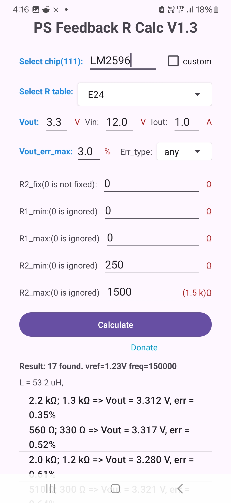
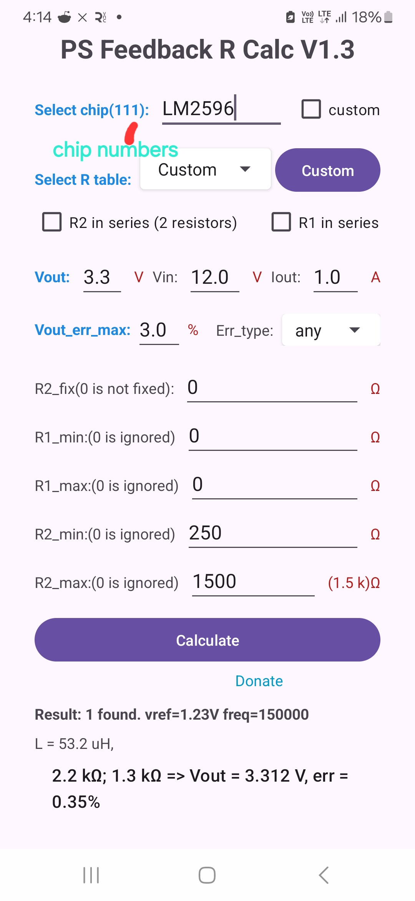
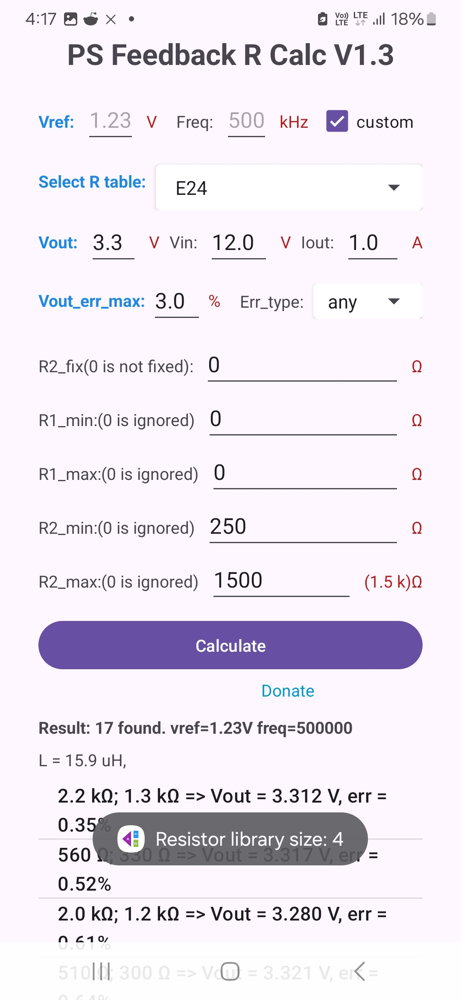
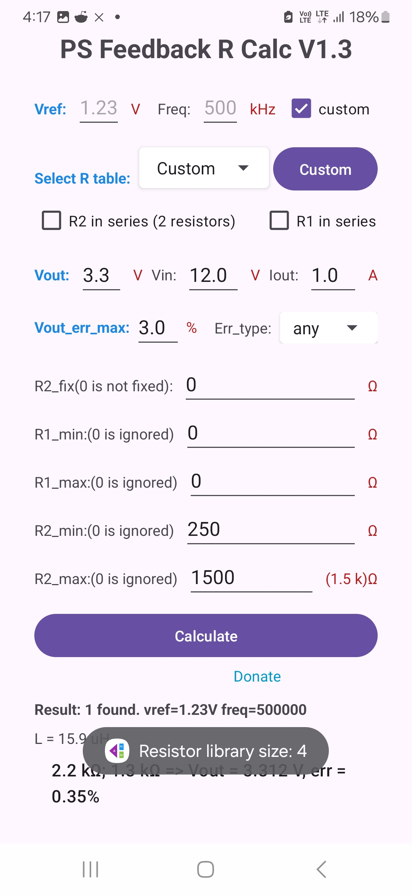
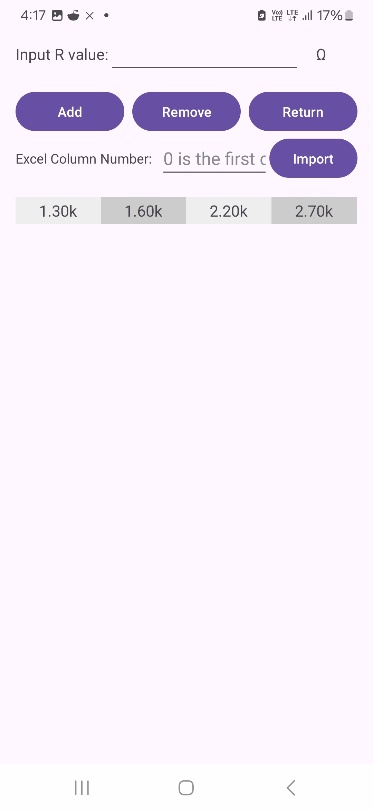

VoltCalcR
VoltCalcR is a feedback resistor calculator for DC-DC converters and adjustable linear regulators. It helps you quickly find optimal resistor values for your target output voltage using a wide range of supported ICs and resistor series.

   
  <b>VoltCalcR1</b>  
   
  <b>VoltCalcR2</b>  
   
  <b>VoltCalcR3</b>  
   
  <b>VoltCalcR4</b>  
   
  <b>VoltCalcR5</b>

---

Features

🔍 Select Chip

Supports 111 popular power ICs.

If your IC is not listed, use custom mode to enter the reference voltage manually.

Switching frequency is used to estimate the inductor value.

Inductor ripple current is assumed to be 30% of output current.

📐 Select R Table (Resistor Series)

Supports IEC standard resistor series: E12, E24, E48, E96, E192, or custom.

In custom mode, you can:

Manually input your own resistor library.

Import resistor values from an Excel file.

Enable resistor series combinations (e.g., R = R1 + R2) to better match the values available in your inventory.

🎯 Output Voltage Accuracy (Vout_err_max)

Set maximum allowable output voltage error as a percentage.

Define error type: positive, negative, or both.

🔒 Fix R2 Option

You can fix R2 and let the calculator find R1 accordingly.

⚙️ Resistor Range Control

R1 and R2 value ranges can be manually set.

In custom IC mode, please refer to your IC datasheet to define proper resistor limits.
## ☕ Support

If you find this project helpful, you can [buy me a coffee](https://www.paypal.me/didadi2024) via PayPal.

Thank you! 🙏